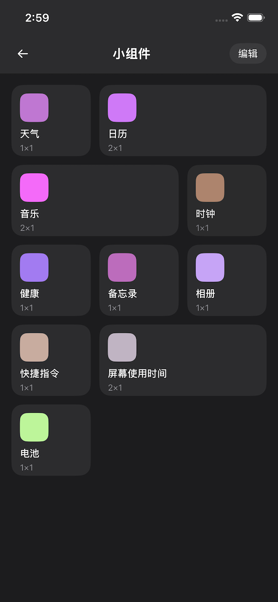
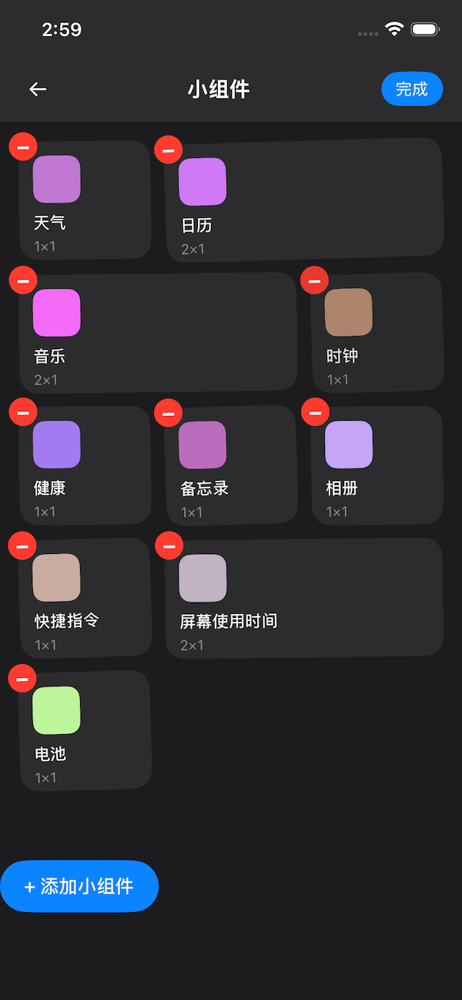

# KuiklyWidgetGrid

一个基于 [KuiklyUI](https://github.com/Tencent-TDS/KuiklyUI) 的卡片式拖动排序组件，类似 iPhone 负一屏的小组件管理体验。

## 📸 效果预览

<p align="center">
  
  &nbsp;&nbsp;&nbsp;&nbsp;
  
</p>

<p align="center">
  <em>左：普通模式 — 支持 1×1 / 2×1 多尺寸卡片混排&nbsp;&nbsp;&nbsp;&nbsp;右：编辑模式 — 长按进入，支持拖拽排序、删除和添加</em>
</p>

## ✨ 功能特性

- **多尺寸卡片** — 支持 1×1 和 2×1 两种网格占位
- **拖拽排序** — 编辑模式下拖动卡片，其他卡片自动"推挤"让位，松手后自动归位
- **智能换行** — 2×1 卡片在目标行放不下时自动移到下一行
- **编辑模式** — 长按进入编辑态，卡片抖动提示可编辑
- **删除卡片** — 编辑态下点击删除按钮移除卡片（iOS 带位置过渡动画）
- **自定义内容** — 卡片外观完全由业务方自定义，组件只负责布局和交互
- **自定义按钮** — 删除按钮和尺寸切换按钮支持自定义内容（如替换为图片图标）
- **高度可配** — 列数、间距、高度、动画参数、抖动效果等均可配置
- **跨平台** — 基于 Kotlin Multiplatform，支持 Android、iOS、HarmonyOS、macOS、Web(JS)

## 📦 项目结构

```
KuiklyWidgetGrid/
├── widgetgrid/                    # 📦 组件库模块（可独立发布到 Maven）
│   ├── build.gradle.kts           # 标准 KMP 构建配置
│   ├── build.ohos.gradle.kts      # 鸿蒙构建配置（ohosArm64）
│   └── src/commonMain/kotlin/com/wwwcg/kuikly/widgetgrid/
│       ├── WidgetGridConfig.kt    # 网格配置
│       ├── WidgetGridItemData.kt  # 卡片数据基类
│       └── WidgetGrid.kt         # 主组件 + 扩展函数
│
├── shared/                        # 📱 Demo 模块（使用示例）
│   ├── build.gradle.kts           # 标准 KMP 构建配置
│   ├── build.ohos.gradle.kts      # 鸿蒙构建配置
│   └── src/commonMain/kotlin/.../demo/
│       └── WidgetGridDemoPage.kt  # 完整使用示例
│
├── androidApp/                    # Android 宿主应用
├── iosApp/                        # iOS 宿主应用
├── ohosApp/                       # HarmonyOS 宿主应用
├── settings.gradle.kts            # 标准 KMP settings
└── settings.ohos.gradle.kts       # 鸿蒙 settings（使用 build.ohos.gradle.kts）
```

## 🚀 快速接入

### 1. 添加依赖

**Maven Central（推荐）：**

```kotlin
// 标准 KMP 项目（Android / iOS / macOS / Web）
kotlin {
    sourceSets {
        val commonMain by getting {
            dependencies {
                implementation("io.github.wwwcg:widgetgrid:1.0.1")
            }
        }
    }
}

// 鸿蒙 (HarmonyOS) 项目
kotlin {
    sourceSets {
        val commonMain by getting {
            dependencies {
                implementation("io.github.wwwcg:widgetgrid:1.0.1-ohos")
            }
        }
    }
}
```

> ⚠️ **鸿蒙项目必须使用 `-ohos` 后缀的版本。** 这是因为鸿蒙构建链使用了不同的 Kotlin 编译器版本（`2.0.21-KBA-010`）和 Kuikly OHOS 专用核心库，与标准 KMP 产物不兼容。这与 Kuikly 核心库自身的发布策略一致。

**本地模块依赖（开发阶段）：**

在 `settings.gradle.kts`（标准）或 `settings.ohos.gradle.kts`（鸿蒙）中：

```kotlin
include(":widgetgrid")
// 鸿蒙配置中还需指定构建文件：
// project(":widgetgrid").buildFileName = "build.ohos.gradle.kts"
```

在业务模块的 `build.gradle.kts` 中：

```kotlin
kotlin {
    sourceSets {
        val commonMain by getting {
            dependencies {
                implementation(project(":widgetgrid"))
            }
        }
    }
}
```

### 2. 定义卡片数据

继承 `WidgetGridItemData`，添加业务需要的自定义属性：

```kotlin
import com.tencent.kuikly.core.base.Color
import com.tencent.kuikly.core.base.PagerScope
import com.tencent.kuikly.core.reactive.handler.observable
import com.wwwcg.kuikly.widgetgrid.WidgetGridItemData

class MyCardData(scope: PagerScope) : WidgetGridItemData(scope) {
    var title: String by observable("")
    var subtitle: String by observable("")
    var iconColor: Color by observable(Color.BLUE)
}
```

> **注意：** 自定义属性建议使用 `by observable()` 委托，以支持 Kuikly 的响应式更新机制。

### 3. 在页面中使用 WidgetGrid

```kotlin
import com.wwwcg.kuikly.widgetgrid.*

@Page("MyWidgetPage")
class MyWidgetPage : BasePager() {

    // 编辑状态（响应式）
    var isEditing by observable(false)

    // WidgetGrid 视图引用，用于调用 addItem 等方法
    lateinit var gridRef: ViewRef<WidgetGridView>

    override fun body(): ViewBuilder {
        val ctx = this
        return {
            attr {
                backgroundColor(Color(0xFF1C1C1EL))
            }

            // ---- 1. 导航栏（包含编辑/完成按钮） ----
            View {
                attr { /* 你的导航栏样式 */ }
                // 编辑/完成按钮
                View {
                    event {
                        click {
                            ctx.isEditing = !ctx.isEditing
                            ctx.gridRef.view?.setEditing(ctx.isEditing)
                        }
                    }
                    Text {
                        attr { text(if (ctx.isEditing) "完成" else "编辑") }
                    }
                }
            }

            // ---- 2. WidgetGrid 组件 ----
            Scroller {
                attr {
                    flex(1f)
                    paddingLeft(16f)
                    paddingRight(16f)
                    paddingTop(16f)
                }

                WidgetGrid {
                    // 获取视图引用
                    ref { ctx.gridRef = it }

                    attr {
                        // 网格配置
                        config = WidgetGridConfig(
                            columnCount = 3,
                            cardHeight = 100f,
                            cardSpacing = 12f,
                        )
                        // 网格可用宽度 = 页面宽度 - 左右 padding
                        gridWidth = pagerData.pageViewWidth - 32f
                        // 绑定编辑状态（响应式）
                        editing = ctx.isEditing

                        // 自定义卡片内容
                        cardContent { item ->
                            val card = item as MyCardData
                            View {
                                attr { flex(1f); padding(12f) }
                                Text {
                                    attr {
                                        text(card.title)
                                        fontSize(14f)
                                        color(Color.WHITE)
                                    }
                                }
                            }
                        }
                    }

                    event {
                        // 编辑态变化（如长按触发进入编辑）
                        onEditingChanged { editing ->
                            ctx.isEditing = editing
                        }
                        // 卡片重新排序完成
                        onReorder { fromIndex, toIndex ->
                            // 持久化新顺序
                        }
                        // 卡片被删除
                        onDelete { item ->
                            // 处理删除后的业务逻辑
                        }
                    }
                }
            }

            // ---- 3. 添加按钮（编辑态显示） ----
            vif({ ctx.isEditing }) {
                View {
                    event {
                        click { ctx.addNewCard() }
                    }
                    Text { attr { text("+ 添加小组件") } }
                }
            }
        }
    }

    override fun viewDidLoad() {
        super.viewDidLoad()
        // 初始化卡片数据
        val items = listOf(
            MyCardData(this).apply { id = 1; spanX = 1; title = "天气" },
            MyCardData(this).apply { id = 2; spanX = 2; title = "日历" },
            MyCardData(this).apply { id = 3; spanX = 1; title = "时钟" },
        )
        gridRef.view?.addItems(items)
    }

    private fun addNewCard() {
        gridRef.view?.addItem(MyCardData(this).apply {
            id = System.currentTimeMillis().toInt()
            spanX = 1
            title = "新组件"
        })
    }
}
```

## 📖 API 参考

### WidgetGridConfig — 网格配置

| 参数 | 类型 | 默认值 | 说明 |
|------|------|--------|------|
| `columnCount` | `Int` | `3` | 列数 |
| `cardHeight` | `Float` | `100f` | 卡片高度（dp） |
| `cardSpacing` | `Float` | `12f` | 卡片间距（dp） |
| `dragScaleRatio` | `Float` | `1.05f` | 拖拽时卡片放大比例 |
| `dragOpacity` | `Float` | `0.9f` | 拖拽时卡片透明度 |
| `dragAnimationDuration` | `Float` | `0.3f` | 拖拽时其他卡片位移动画时长（秒） |
| `shakeEnabled` | `Boolean` | `true` | 是否启用编辑态抖动效果 |
| `shakeInterval` | `Int` | `200` | 抖动切换间隔（毫秒） |
| `shakeAngleBase` | `Float` | `1.2f` | 基础抖动角度（度） |
| `shakeAngleOffset` | `Float` | `0.5f` | 相邻卡片角度偏移，让抖动更自然 |
| `shakeAnimationDuration` | `Float` | `0.2f` | 抖动动画时长（秒） |
| `longPressDelay` | `Int` | `350` | 长按触发延迟（毫秒） |
| `cardBackgroundColor` | `Color` | `0xFF2C2C2E` | 卡片默认背景色 |
| `cardBorderRadius` | `Float` | `16f` | 卡片圆角半径（dp） |
| `deleteButtonSize` | `Float` | `24f` | 删除按钮尺寸（dp） |
| `deleteButtonOffset` | `Float` | `-8f` | 删除按钮相对左上角偏移（dp），负值向外延伸 |
| `deleteButtonColor` | `Color` | `0xFFFF3B30` | 删除按钮背景色 |
| `resizeEnabled` | `Boolean` | `false` | 是否在编辑态显示右上角尺寸切换按钮 |
| `resizeButtonSize` | `Float` | `24f` | 切换按钮尺寸（dp） |
| `resizeButtonOffset` | `Float` | `-8f` | 切换按钮相对右上角偏移（dp），负值向外延伸 |
| `resizeButtonColor` | `Color` | `0xFF007AFF` | 切换按钮背景色 |

### WidgetGridItemData — 卡片数据基类

| 属性 | 类型 | 说明 |
|------|------|------|
| `id` | `Int` | 卡片唯一标识 |
| `spanX` | `Int` | 横向占位格数（`1` = 1×1，`2` = 2×1） |

> 继承此类添加业务自定义属性，使用 `by observable()` 委托支持响应式更新。

### WidgetGridAttr — 组件属性

| 属性/方法 | 类型 | 说明 |
|-----------|------|------|
| `config` | `WidgetGridConfig` | 网格配置 |
| `editing` | `Boolean` | 编辑模式开关（响应式，外部控制） |
| `gridWidth` | `Float` | 网格可用宽度（dp） |
| `cardContent { }` | 函数 | 卡片内容构建器，接收 `WidgetGridItemData` 参数 |
| `deleteButtonContent { }` | 函数 | 自定义删除按钮内容，替换默认的红色圆形按钮 |
| `resizeButtonContent { }` | 函数 | 自定义尺寸切换按钮内容，替换默认的蓝色圆形按钮 |

### WidgetGridEvent — 组件事件

| 事件 | 参数 | 说明 |
|------|------|------|
| `onEditingChanged` | `(Boolean) -> Unit` | 编辑状态变化（如长按触发进入编辑态） |
| `onReorder` | `(fromIndex: Int, toIndex: Int) -> Unit` | 卡片拖拽排序完成 |
| `onDelete` | `(WidgetGridItemData) -> Unit` | 卡片被删除 |
| `onCardClick` | `(WidgetGridItemData) -> Unit` | 非编辑态下点击卡片 |
| `onResize` | `(item, oldSpanX, newSpanX) -> Unit` | 卡片尺寸切换 |

### WidgetGridView — 视图方法（通过 ViewRef 调用）

| 方法 | 说明 |
|------|------|
| `addItem(item)` | 添加单个卡片 |
| `addItems(items)` | 批量添加卡片 |
| `removeItem(id)` | 根据 id 移除卡片（带动画） |
| `getItems()` | 获取当前卡片列表的副本 |
| `setEditing(editing)` | 设置编辑状态（同时触发 `onEditingChanged` 事件） |

## 🔧 进阶用法

### 自定义网格布局

```kotlin
// 2 列布局，大间距，高卡片
config = WidgetGridConfig(
    columnCount = 2,
    cardHeight = 150f,
    cardSpacing = 20f,
)
```

### 自定义卡片样式

```kotlin
config = WidgetGridConfig(
    cardBackgroundColor = Color.WHITE,
    cardBorderRadius = 24f,
    deleteButtonColor = Color(0xFFE53935L),
    deleteButtonSize = 28f,
    deleteButtonOffset = -10f,
)
```

### 自定义删除/尺寸切换按钮

通过 `deleteButtonContent` 和 `resizeButtonContent` 可以完全替换默认按钮的内部内容（如换成图片图标）。外层容器的定位、尺寸和点击事件仍由组件管理。

```kotlin
WidgetGrid {
    attr {
        config = WidgetGridConfig(
            resizeEnabled = true,
            deleteButtonSize = 28f,
            resizeButtonSize = 28f,
        )
        gridWidth = pagerData.pageViewWidth - 32f
        editing = ctx.isEditing

        cardContent { item -> /* ... */ }

        // 替换删除按钮为自定义图标
        deleteButtonContent { item ->
            Image {
                attr {
                    src("delete_icon.png")
                    size(28f, 28f)
                }
            }
        }

        // 替换尺寸切换按钮为自定义图标
        resizeButtonContent { item ->
            Image {
                attr {
                    src("resize_icon.png")
                    size(28f, 28f)
                }
            }
        }
    }
}
```

> **注意：** 使用自定义 builder 时，默认的 `backgroundColor` 和 `borderRadius` 不会应用，按钮外观完全由业务方控制。按钮尺寸和偏移仍通过 `WidgetGridConfig` 的对应参数配置。

### 关闭抖动效果

```kotlin
config = WidgetGridConfig(
    shakeEnabled = false,
)
```

### 调整拖拽手感

```kotlin
config = WidgetGridConfig(
    dragScaleRatio = 1.1f,       // 拖拽时放大更多
    dragOpacity = 0.8f,          // 更透明
    dragAnimationDuration = 0.5f, // 其他卡片移动更慢
    longPressDelay = 500,        // 长按更久才触发
)
```

### 在 cardContent 中使用条件渲染

```kotlin
cardContent { item ->
    val card = item as MyCardData

    // 响应式属性变化 → 在 attr 块中读取
    Text {
        attr {
            text(card.title) // card.title 变化时自动更新
            color(Color.WHITE)
        }
    }

    // 条件渲染 → 使用 vif 指令
    vif({ (item as MyCardData).showBadge }) {
        View {
            attr {
                size(8f, 8f)
                backgroundColor(Color.RED)
                borderRadius(4f)
            }
        }
    }
}
```

## ⚠️ 平台差异说明

| 行为 | iOS | Android | HarmonyOS | macOS | Web(JS) |
|------|-----|---------|-----------|-------|---------|
| 删除动画 | ✅ 其他卡片平滑过渡到新位置 | ⚡ 直接删除，无位置过渡动画 | ✅ 同 iOS | ✅ 同 iOS | ✅ 同 iOS |
| 拖拽动画 | ✅ 弹性动画（springEaseInOut） | ✅ 弹性动画 | ✅ 弹性动画 | ✅ 弹性动画 | ✅ 弹性动画 |
| 抖动动画 | ✅ 正常 | ✅ 正常 | ✅ 正常 | ✅ 正常 | ✅ 正常 |

> Android 删除时不使用位置过渡动画，是为了避免抖动动画与位移动画在该平台上的冲突。其他平台均支持平滑过渡。

## 📋 注意事项

1. **卡片数据的 PagerScope**：创建 `WidgetGridItemData`（或其子类）时，需传入 `PagerScope`（通常是 Pager 的 `this`）。

2. **添加卡片的时机**：通过 `gridRef.view?.addItems(...)` 添加卡片，需要在 `viewDidLoad()` 或之后调用，确保 `gridRef` 已绑定。

3. **编辑状态同步**：组件的编辑状态有两种控制方式：
   - **外部控制**：通过 `attr { editing = ... }` 响应式绑定
   - **方法调用**：通过 `gridRef.view?.setEditing(true/false)` 命令式调用

   当用户长按进入编辑态时，组件会触发 `onEditingChanged(true)` 事件，业务方需在此回调中同步自己的状态。

4. **gridWidth**：必须设置 `gridWidth`，组件需要此值计算卡片宽度和布局。通常为 `pagerData.pageViewWidth - 左右 padding`。

5. **Scroller 包裹**：`WidgetGrid` 本身不包含滚动容器，需要业务方用 `Scroller` 包裹，以支持内容超出屏幕时滚动。

## 🔨 构建说明

本项目采用**双构建配置**，分别对应标准 KMP 平台和鸿蒙平台：

| 构建目标 | settings 文件 | build 文件 | Kotlin 版本 | Kuikly 版本 | 支持平台 | 发布版本号 |
|----------|--------------|------------|------------|------------|----------|-----------|
| 标准 KMP | `settings.gradle.kts` | `build.gradle.kts` | `2.1.21` | `2.15.2-2.1.21` | Android、iOS、macOS、Web(JS) | `x.y.z` |
| 鸿蒙 | `settings.ohos.gradle.kts` | `build.ohos.gradle.kts` | `2.0.21-KBA-010` | `2.15.2-2.0.21-ohos` | Android、iOS、HarmonyOS | `x.y.z-ohos` |

**标准构建：**

```bash
./gradlew :widgetgrid:build
```

**鸿蒙构建：**

```bash
./gradlew -c settings.ohos.gradle.kts :widgetgrid:build
```

> **为什么需要两套构建？** 鸿蒙 (HarmonyOS) 的 Kotlin 编译器插件（`2.0.21-KBA-010`）是专门的 fork，与标准 Kotlin `2.1.21` 编译出的产物不兼容。Kuikly 核心库自身也是分版本发布的（`2.15.2-2.1.21` vs `2.15.2-2.0.21-ohos`），因此基于 Kuikly 的组件库也必须分别构建和发布。

### 版本对应关系

每次发版需要同时发布两个版本：

| Maven GAV | 适用场景 |
|-----------|---------|
| `io.github.wwwcg:widgetgrid:1.0.1` | 标准 KMP 项目（Android / iOS / macOS / Web） |
| `io.github.wwwcg:widgetgrid:1.0.1-ohos` | 鸿蒙项目（Android / iOS / HarmonyOS） |

### 发布脚本

项目提供了一键构建发布脚本 `publish.sh`，支持通过 [Maven Central API](https://central.sonatype.com/api-doc) 自动上传：

```bash
# 构建全部（标准 + 鸿蒙），不上传
./publish.sh

# 仅构建标准版 / 鸿蒙版
./publish.sh standard
./publish.sh ohos

# 构建 + 自动上传到 Maven Central
./publish.sh --upload

# 跳过构建，仅上传已有的 bundle
./publish.sh --upload-only
```

> API 上传需要在 `~/.gradle/gradle.properties` 中配置 Sonatype Token，详见 `publish.sh` 中的注释。

## 📄 License

MIT License
